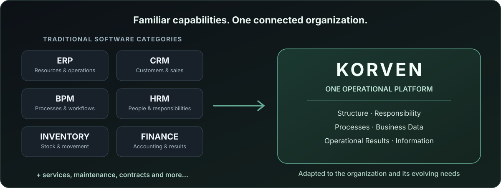
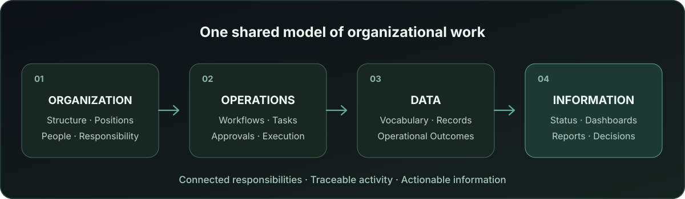
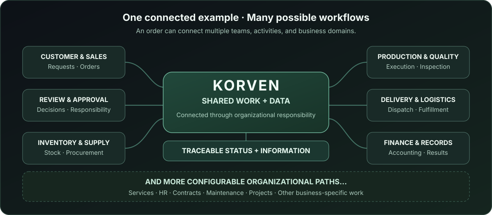

 

<h2>Organization in Flow</h2>

**One Organization. One Operational System.**

**The capabilities organizations traditionally spread across ERP, CRM, BPM, HR, inventory, finance, production, and reporting — designed to work together in one operational platform.**

Korven connects how an organization is structured, how work moves, what operations produce, and what decision-makers can see.

 

## Why Korven Exists

Organizations have spent decades digitizing different parts of their operations. ERP supports resources and business operations. CRM organizes customer relationships and sales. BPM manages processes and workflows. Specialized applications support people, inventory, accounting, production, service, and reporting.

These systems solve real problems, and many modern suites cover multiple business domains. Yet organizations still frequently operate across a mixture of separate applications, spreadsheets, paper forms, manual approvals, and disconnected records.

Consider a customer order. Customer information may live in CRM, approvals in a workflow tool, stock in inventory software, production in another system, and financial results in accounting. A manager may need to reconcile several sources just to understand the status of one operation.

**The underlying challenge is continuity across the organization:** connecting responsibility, execution, data, outcomes, and visibility as one body of work.

Korven was conceived around a different starting point:

> **What if we built the organization itself as one operational system, instead of digitizing each part separately?**

 

# The Korven Idea

An organization is a connected system of units, positions, people, responsibilities, business activities, information, and decisions. Real work moves between those elements. Every activity may receive, create, process, or change information, and the resulting records inform the next activity and the decisions that follow.

**Korven provides one shared environment in which those relationships can be modeled, operated, and understood together.**

It is designed to serve organizations ranging from small businesses to complex enterprises. Each organization can shape the platform around its own structure, operational domains, processes, and information needs.

The four areas work as a connected whole:

<table>
<tr>
<td width="50%" valign="top">

### Organization & Responsibility

Define the organization, its units and positions, the people who fill them, and the responsibilities and authority through which work is carried out.

</td>
<td width="50%" valign="top">

### Processes & Operations

Design and run the flows that move real work between organizational positions, including actions, approvals, handoffs, and operational decisions.

</td>
</tr>
<tr>
<td width="50%" valign="top">

### Data & Outcomes

Give business information a consistent meaning and structure. Capture what work produces, preserve its context, and turn valid operational results into reliable business records.

</td>
<td width="50%" valign="top">

### Information & Decisions

Turn connected operational records into status views, histories, metrics, dashboards, and reports that support management and day-to-day decisions.

</td>
</tr>
</table>

 

# Familiar Software Capabilities. One Connected Platform.

Korven is designed to bring needs traditionally served by separate software categories into the same organizational environment.

| Familiar category | What organizations can build and operate with Korven |
|---|---|
| **ERP** | Connected resources, purchasing, sales, financial activities, inventory, production, and cross-domain operations. |
| **CRM** | Customer information, relationships, opportunities, sales activities, and customer-facing workflows. |
| **BPM & Workflow** | Business-process design, execution, approvals, handoffs, and operational tracking. |
| **HRM** | Personnel information, organizational positions, assignments, responsibility, and people-related processes. |
| **Inventory & WMS** | Stock, storage, movements, warehouse activities, and related operational records. |
| **Finance & Accounting** | Financial operations, accounting records, and governed financial results. |
| **Production** | Manufacturing activities, production workflows, quality-related work, and production outcomes. |
| **BI & Reporting** | Dashboards, indicators, status views, reports, and traceable management information. |
| **Other organizational domains** | Service, procurement, logistics, contracts, maintenance, project operations, and additional business-specific processes. |

These are examples of **Korven's intended product coverage**, not a fixed list of modules or a claim that every capability is already shipped.

**Where the required capabilities are implemented and configured, Korven can take the place of separate applications serving those needs.** Its value grows as more of the organization's operations become part of the same connected system.

 

# A Connected Workflow — As Wide as the Organization

Imagine a manufacturing business receiving a customer order. That order may involve customer management and sales, internal approval, stock assessment, procurement, production, quality control, packaging, delivery, and financial settlement.

In Korven, these activities can belong to a connected operational flow. Work is associated with the appropriate organizational responsibilities, while the information produced at each stage remains available to authorized downstream activities and information views.

**This is one example, not a prescribed sequence or a limit on the platform.**

Another organization might begin with a service request, a purchasing need, an equipment failure, a new employee, a contract, or a new project. Its workflow might branch across different positions and departments, produce multiple outcomes, and finish in a different part of the business.

Korven is designed so that these different paths can be defined around the organization, with their own responsibilities, data, results, and visibility.

The goal is a connected view of **what happened, who was responsible, what information was produced, which operational results were recorded, and what needs attention next**.

 

# Shape Korven Around the Organization You Actually Run

A small trading business and a large manufacturing organization have different structures, operational complexity, and information needs.

Korven's no-code product approach is intended to let organizations define and evolve their own structure, data, processes, and information views without turning every operational change into a custom software project.

That flexibility is paired with controlled responsibility, access, data meaning, and authoritative business results.

> **Flexible enough to fit the organization. Structured enough to keep it trustworthy.**

As an organization grows, additional units, positions, activities, and business domains can become part of the same operating environment.

 

# Reusable Organizational Knowledge

Organizations should be able to build on established operational knowledge instead of starting every configuration from zero.

Korven's template system is designed around four connected families:

| Template family | What it helps an organization establish |
|---|---|
| **Organization** | Organizational structure, positions, responsibilities, and reporting relationships. |
| **Data Structure** | Business data domains, logical containers, and shared data vocabulary. |
| **Process** | Reusable business flows and their operational requirements. |
| **Information Projection** | Governed definitions of how organizational information is read and presented. |

Templates can provide a starting point, then be adapted into the organization's own operational model. This enables reusable practices without requiring every business to operate in exactly the same way.

 

# From Daily Activity to a Clearer Organization

The information a business needs to run should come from the work it actually performs.

In Korven, the intended connection between organizational structure, processes, semantic business data, operational results, and information views gives authorized people a more coherent way to understand operations — from an individual task to a cross-department process or organization-wide status.

**One organization. Connected operations. Information grounded in the work.**

 

## Current Status

**Active Product Development**

Korven is being developed as a comprehensive integrated organizational operations platform, with a phased, end-to-end delivery program.

At the last documented accepted product baseline, the implemented foundation includes authentication, the organizational/tenant boundary, platform navigation, and core organization creation and management flows. Organization Studio, personnel and assignment foundations are under active development. Data management, process execution, additional operational domains, and information projections are part of the defined broader product scope.

The software categories and cross-domain scenarios above describe the **product vision and intended capabilities**. Availability of individual functions depends on their implementation and release status.

 

<strong>Technology, Public Scope & Proprietary Boundary</strong>

 

### Product-Level Technology Approach

Korven is designed around a configurable organizational operating model. The current engineering direction uses a modular application architecture and a dedicated product design system, with a Persian-first, RTL-first experience for its initial market.

### Public Scope

This repository presents the public product vision, the problem Korven addresses, its intended coverage, its operating principles, and selected conceptual illustrations.

Private source code, detailed domain models, authorization rules, execution contracts, internal schemas, template-resolution logic, orchestration mechanisms, and other proprietary implementation details remain outside this public repository.

 

---

### KORVEN™

<h3>Organization in Flow</h3>

**One Organization. One Operational System.**

 

### Designed & Developed by [Ali Alavi](https://github.com/alaviarts)

**Product & Systems Architect**

**© 2026 Ali Alavi. All rights reserved.**

 

*An integrated operating environment for the organization as a whole.*

